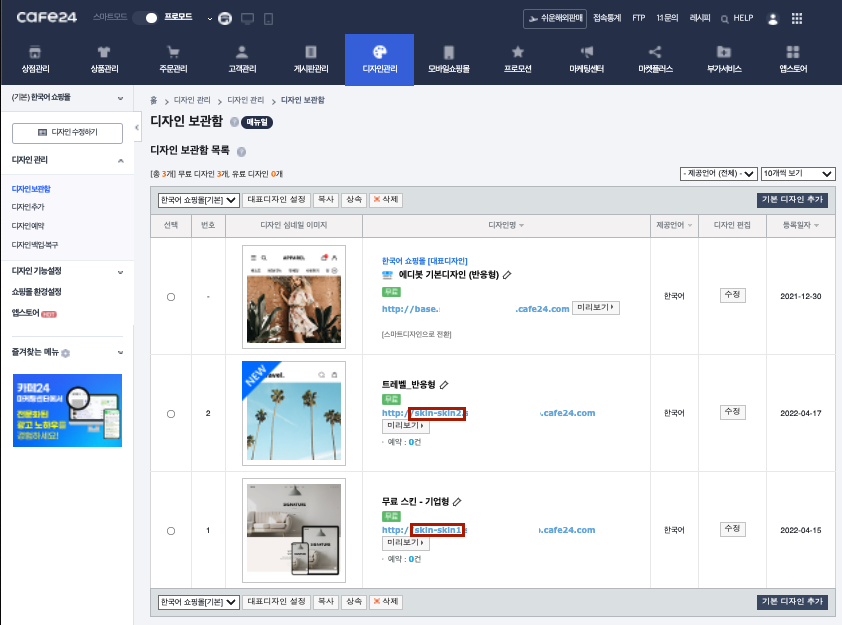

# Cafe24 Theme Crawler

> Node.js + Puppeteer 기반 Cafe24 스마트디자인 스킨 백업 크롤러

## Installation

본 프로젝트의 NPM 의존성 패키지 설치 및 빌드

```
npm install
npm run build
```

본 프로젝트는 Puppeteer에 의존성을 두고있다. NPM 패키지를 설치하면 Puppeteer 풀버전이 다운로드 되는데,  
Puppeteer의 풀버전 내의 Chromium은 Intel 버전이기 때문에 M1 환경에서 구동하기 위해선 ARM 버전 Chromium을 설치해야한다.

```
brew install chromium --no-quarantine
```

설치 후 rc파일(~/.zshrc or ~/.bash_profile)에 아래 환경변수를 설정해준다

```
export PUPPETEER_SKIP_CHROMIUM_DOWNLOAD=true
export PUPPETEER_EXECUTABLE_PATH=`which chromium`
```

## Getting Started

툴 사용을 위해선 우선 환경 변수를 설정해주어야한다.  
env 폴더 내 ".env.template" 파일을 복제 또는 이름을 변경하여 ".env"라는 파일을 만든다.
그리고 ".env" 파일의 내용을 아래와 같이 수정한다.

```
CAFE24_ID={스킨을 크롤링한 Cafe24 쇼핑몰의 ID}
CAFE24_PSWD={스킨을 크롤링한 Cafe24 쇼핑몰의 로그인 패스워드}
SKIN_ID={크롤링할 스킨의 서브도메인(","로 구분하여 여러개의 스킨 지정 가능)}

ex)
CAFE24_ID=testid1234
CAFE24_PSWD=pwpw1234
SKIN_ID=skin-skin1,skin-skin2,skin-mobile1
```



크롤링할 스킨의 서브 도메인은 Cafe24 관리자 패널 접속 후 "디자인관리 -> 디자인보관함" 또는 "모바일쇼핑몰 -> 디자인보관함"에 접속시 위 이미지에 표시한 부분을 복사해서 가져오면 된다 (\*주의: 본 프로젝트는 "스마트디자인" 스킨만을 지원하기 때문에 "애디봇디자인"의 경우 스마트디자인으로 변환해야만 크롤링할 수 있다.)

환경 변수 설정 완료 후 아래 명령어로 크롤링을 시작하면 된다.

```
npm start
```
